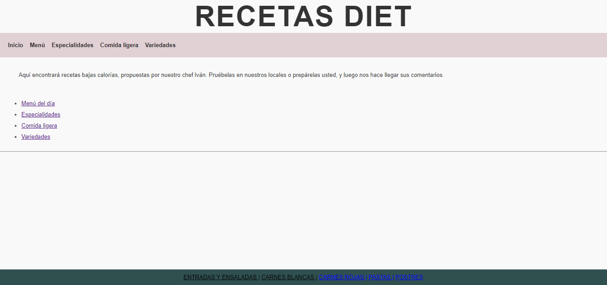

# 🍴 Restaurant Menu Blog

## 🖋️ Descripción
Este proyecto es un **blog de menú de restaurante** desarrollado en **HTML** y **CSS**.  
Se trata de un diseño elegante y minimalista para mostrar la carta de un restaurante, incluyendo categorías como entradas, platos principales, postres y bebidas.  
Ideal para quienes deseen practicar maquetación web y diseño responsive.  

---

## 💡 Características
- 🌟 **Diseño responsive:** Adaptado para dispositivos móviles y pantallas grandes.  
- 🎨 **Colores minimalistas:** Combinaciones elegantes y suaves.  
- 🍲 **Secciones organizadas:** Entradas, platos principales, postres y bebidas.  
- 🖌️ **Fácil personalización:** Cambia los colores, tipografía o imágenes según el estilo del restaurante.  

---

## 🚀 Vista previa
Puedes abrir el archivo **proyectoRecetas.html** directamente en tu navegador para ver el proyecto en acción.  
¡Explora el diseño y las características visuales de este menú interactivo!  

---

## 🛠️ Herramientas utilizadas
- **HTML5**  
- **CSS3**  
- **Google Fonts** para tipografías.   

---

## 📸 Capturas de pantalla
🌐 Vista de la página principal:  

---

## 🤝 Contribuciones
¿Tienes ideas para mejorar este proyecto? ¡Contribuye libremente!  
1. Realiza un fork de este repositorio.  
2. Crea una nueva rama para tu funcionalidad (`git checkout -b feature/nueva-funcion`).  
3. Realiza un pull request cuando tu mejora esté lista.  

---

## ©️ Créditos
Este blog de menú de restaurante fue desarrollado como un proyecto para practicar HTML y CSS.  
Diseñado con ❤️ por [Avalob].

---

## ⭐️ ¡Dale una estrella!
Si te gusta este proyecto o te resulta útil, ¡no olvides darle una ⭐️ al repositorio!  
